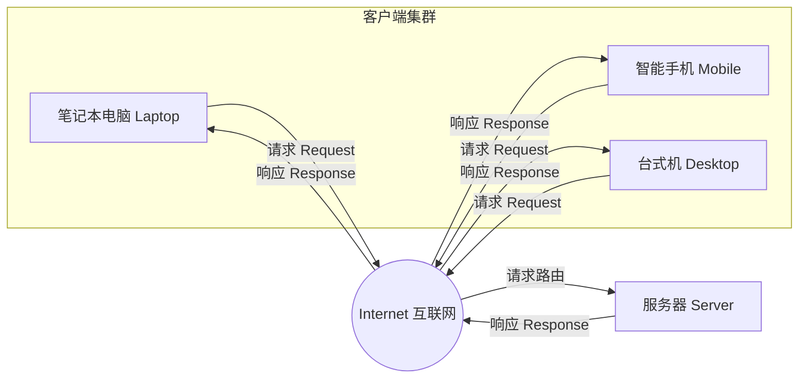
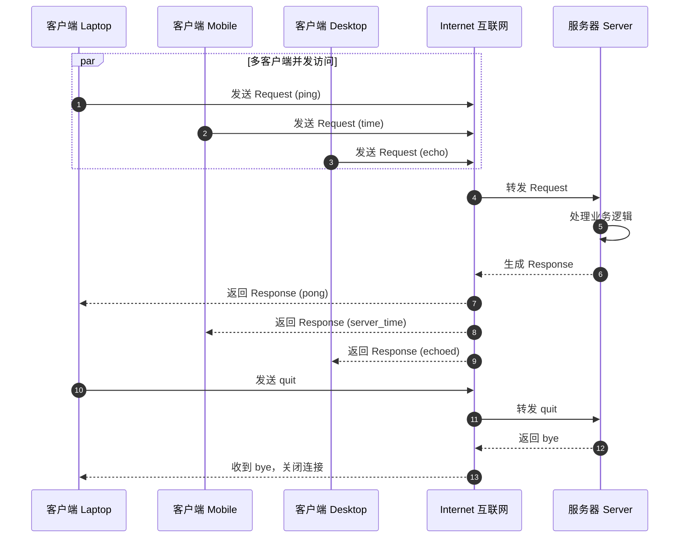

# 架构解析与实现报告

## 1. 系统拓扑架构分析

### 1.1 架构图概览

附件 `architecture_diagram.png` 展示了一个经典的 **客户端-服务器（Client-Server）星型拓扑** 架构，包含以下核心节点：

| 节点 | 角色 | 说明 |
|------|------|------|
| **Laptop（笔记本电脑）** | 客户端 | 无线接入，异构终端之一 |
| **Mobile（智能手机）** | 客户端 | 移动网络接入，异构终端之一 |
| **Desktop（台式机）** | 客户端 | 有线接入，异构终端之一 |
| **Internet（互联网云）** | 传输中介 | 连接客户端与服务器的公共网络 |
| **Server（服务器）** | 服务端 | 集中式处理请求的中心节点 |

### 1.2 节点角色与职责

- **客户端（Clients）**：请求的发起方。负责收集用户意图、构造请求报文，并通过 Internet 发送给服务器；收到响应后解析并展示结果。图中展示了三种异构设备，说明该系统支持多终端、多接入方式的统一访问。
- **Internet（互联网）**：透明的传输层中介。负责将客户端报文路由到服务器，并将服务器响应回传给对应客户端。它屏蔽了底层物理网络差异，是客户端与服务器之间的逻辑通道。
- **Server（服务器）**：请求的处理方与资源中心。集中接收来自所有客户端的请求，执行业务逻辑，并将结果封装为响应返回。服务器是单一权威数据源，负责一致性管控。

### 1.3 通信传输方向

```
客户端 (Laptop/Mobile/Desktop)
        │
        │  ① Request（请求上行）
        ▼
    [ Internet ]
        │
        │  ② Request 路由转发
        ▼
      [ Server ]
        │
        │  ③ Response（响应下行）
        ▼
    [ Internet ]
        │
        │  ④ Response 回传
        ▼
客户端 (Laptop/Mobile/Desktop)
```

- **上行链路（客户端 → 服务器）**：承载客户端发起的请求（Request），例如 `ping`、查询、提交数据等。
- **下行链路（服务器 → 客户端）**：承载服务器处理后生成的响应（Response），例如 `pong`、查询结果、确认信息等。

### 1.4 请求-响应机制

系统采用 **同步请求-响应（Request-Response）** 交互模型：

1. **建立连接**：客户端通过 Internet 与服务器建立网络连接（图中直线箭头表示逻辑连接）。
2. **发送请求**：客户端将请求序列化为报文（本实现中为 JSON 行协议），发送至服务器。
3. **服务器处理**：服务器解析请求，执行对应业务逻辑，可能访问资源或计算。
4. **返回响应**：服务器将结果封装为响应报文，原路返回给发起请求的客户端。
5. **客户端展示**：客户端解析响应并呈现给用户。

整个交互是 **一对一、有状态或可无状态** 的：每个请求对应一个确定的响应；服务器不主动向客户端推送数据，完全由客户端驱动。

---

## 2. 优缺点分析

### 2.1 优点

1. **集中式数据管理**：所有数据与业务逻辑集中在服务器，便于统一维护、备份和一致性控制。
2. **客户端轻量化**：客户端（手机/笔记本/台式机）仅负责交互与展示，无需存储大量数据，降低了终端硬件要求。
3. **架构清晰、易于扩展**：星型拓扑结构直观，新增客户端只需接入 Internet，无需改动服务器逻辑。
4. **安全性可控**：安全策略、鉴权、加密可统一在服务器实现，客户端难以绕过。
5. **多终端异构兼容**：图中三种不同设备统一通过 Internet 协议访问同一服务器，天然支持跨平台。

### 2.2 缺点

1. **单点故障（Single Point of Failure）**：所有客户端依赖中心服务器，服务器宕机将导致整个系统不可用。
2. **服务器性能瓶颈**：并发客户端数量增加时，服务器负载与带宽成为瓶颈，可能引发响应延迟或拒绝服务。
3. **网络依赖性强**：客户端与服务器必须保持网络连通，弱网/断网环境下体验下降。
4. **扩展成本高**：横向扩展通常需要负载均衡、集群等高成本方案，纵向扩展受硬件上限约束。
5. **响应延迟受网络链路影响**：请求需往返于客户端与服务器，物理距离越远延迟越高（如图中 Internet 传输环节）。

---

## 3. 代码实现说明

配套文件 `client_server.py` 使用 **Python asyncio** 高度还原了上述拓扑：

- **服务器端**：`asyncio.start_server` 创建异步 TCP 服务器，`handle_client` 协程为每个连接维护会话；通过 JSON 行协议解析请求、分发处理（`ping` / `time` / `echo` / `stats`），并返回响应。
- **客户端**：三个异构客户端协程（Laptop / Mobile / Desktop）通过 `asyncio.open_connection` 连接服务器，模拟了不同网络延迟（`latency_ms`），并发发送请求序列并接收响应。
- **并发模型**：`asyncio.gather` 并发执行所有客户端，体现多终端同时访问服务器的场景；服务器内部使用 `asyncio.sleep` 让出事件循环，保持非阻塞。

---

## 4. Mermaid 拓扑序列图

### 4.1 系统拓扑图



### 4.2 请求-响应时序图



---

## 5. 运行验证结果

执行 `python3 client_server.py` 后，程序成功启动服务器、并发处理三个客户端请求并返回响应，最后正常关闭。详细输出见终端日志。

---

## 6. 总结

该架构图呈现了一个标准的多终端客户端-服务器模型。它凭借集中式管理、简单清晰的结构和对异构终端的良好兼容性，成为大多数 Web 服务、App 后端和数据库应用的基础形态；同时其单点故障与性能瓶颈的固有缺陷，也驱动着实际系统向集群、负载均衡、缓存与 CDN 等方向演进。本报告通过 Python asyncio 代码与 Mermaid 图完整还原并说明了该架构的交互流程。
